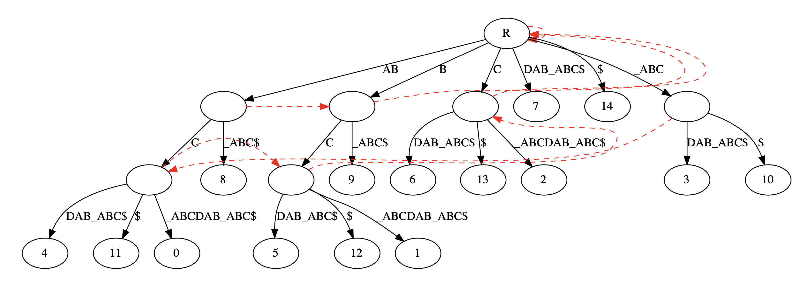

# Ukkonen Algorithm

## Quick Overview

[String Algorithms - Ukkonen's algorithm by MiNiWolF](https://www.youtube.com/channel/UCsCm7a-qKob6gnsgENoE4zg)

[Suffix Tree using Ukkonen's algorithm by Tushar Roy](https://www.youtube.com/watch?v=aPRqocoBsFQ) . 

## Implementations

- Wiki https://en.wikipedia.org/wiki/Ukkonen%27s_algorithm
- Ukkonen's suffix tree algorithm http://programmerspatch.blogspot.com/2013/02/ukkonens-suffix-tree-algorithm.html

## Set Up

Install graphviz in Anaconda 3 for suffix tree visualization

